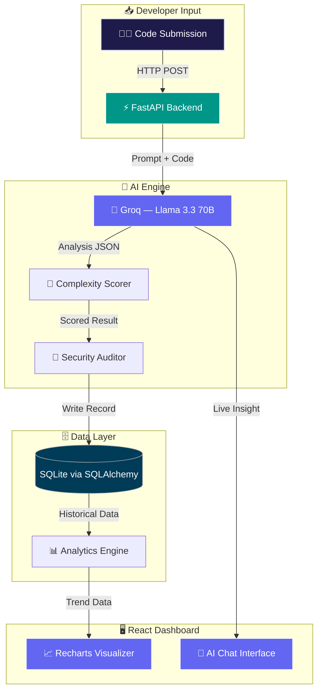

<div align="center">


  [](https://git.io/typing-svg)

  <br/>

  

  <br/><br/>

  [](https://reactjs.org)
  [](https://fastapi.tiangolo.com)
  [](https://groq.com)
  [](https://sqlite.org)
  [](https://docker.com)
  [](https://tailwindcss.com)

  <br/>

</div>

---

## 🚩 The Problem: Silent Technical Debt

Traditional code review is slow, manual, and happens too late. By the time a senior engineer reviews a PR, the damage is done — complexity has crept in, security gaps are baked deep, and refactoring costs 10× more than it should have.

Engineering teams waste cycles on:

1. Manual complexity audits that slow down delivery velocity
2. Security vulnerabilities found at production, not at commit
3. Leadership flying blind on codebase health trends
4. Senior architects stuck reviewing routine quality gates instead of innovating

**DevScope AI shifts all of that to the moment you write the code.**

---

## ✨ What DevScope AI Does

DevScope is an automated **Code Intelligence Platform** — a DevOps Cockpit that audits your code in real-time before it ever reaches production.

| Feature | Description |
|---|---|
| ⚡ **Sub-500ms Inference** | Near-instantaneous refactoring suggestions powered by Groq LPU |
| 🔐 **Security Auditing** | Identifies critical vulnerabilities at write-time, not deploy-time |
| 📊 **Complexity Scoring** | Quantifies architectural complexity and flags debt hotspots |
| 📈 **Health Trend Analytics** | 100% visibility into historical codebase health via data-driven dashboards |
| 🧠 **AI Refactor Engine** | Llama 3.3 70B generates actionable refactoring suggestions in context |

---

## 🏗️ Architecture



---

## 💼 Strategic Value

| Metric | Impact |
|---|---|
| 🚀 Manual review overhead reduced | **65%** |
| ⚡ AI inference latency | **< 500ms** |
| 👁️ Codebase health visibility | **100%** |
| 💸 Late-stage bug fix cost reduction | **Significant** |

---

## ⚙️ Engineering Highlights

### 1. AI Analysis Engine (`analyzer.py`)
The core intelligence layer sends code to Groq's Llama 3.3 70B with a structured prompt that returns complexity scores, security flags, and refactoring suggestions — all in a single sub-500ms inference pass.

### 2. Persistent Health Tracking (`database.py`)
Every analysis is stored via SQLAlchemy to SQLite, building a longitudinal record of codebase health. The analytics engine queries this history to surface trends — turning invisible debt into a visible, manageable metric.

### 3. Cinematic Developer Interface
The frontend is designed around minimizing cognitive load — a high-fidelity starfield canvas, modular component architecture, and a real-time chat interface keep engineers in a productive flow state during complex refactoring work.

---

## 🛠️ Tech Stack

| Layer | Technologies |
|---|---|
| **Frontend** | React 18, Vite, Tailwind CSS, Recharts |
| **Backend** | Python 3.10+, FastAPI, Uvicorn |
| **AI / ML** | Llama 3.3 (70B), Groq LPU Inference |
| **Database** | SQLAlchemy, SQLite |
| **DevOps** | Docker, Docker Compose |
| **Integrations** | Axios, Pydantic, python-dotenv |

---

## 📂 Project Structure

```
devscope-ai/
├── backend/
│   ├── main.py             # FastAPI entry point & API routes
│   ├── analyzer.py         # AI logic & Groq API integration
│   ├── database.py         # SQLite connection & SQLAlchemy models
│   ├── .env                # API keys (environment variables)
│   └── devscope.db         # Generated SQLite database file
├── frontend/
│   ├── src/
│   │   ├── components/
│   │   │   ├── Sidebar.jsx
│   │   │   ├── ChatBubble.jsx
│   │   │   ├── CodeWindow.jsx
│   │   │   ├── MetricsBar.jsx
│   │   │   ├── InputArea.jsx
│   │   │   ├── IssueGraph.jsx
│   │   │   └── Starfield.jsx
│   │   ├── App.jsx         # Main logic & state
│   │   ├── main.jsx        # React entry point
│   │   └── index.css       # Global styles & Tailwind
│   ├── tailwind.config.js
│   ├── package.json
│   └── vite.config.js
└── README.md
```

---

## 🚀 Getting Started

### Prerequisites
- Python 3.8+
- Node.js v16+ & npm
- A [Groq API key](https://console.groq.com) (free)

### Backend

```bash
cd backend

# Create and activate virtual environment
python -m venv .venv
source .venv/bin/activate        # Windows: .\.venv\Scripts\activate

# Install dependencies
pip install fastapi uvicorn sqlalchemy groq python-dotenv python-multipart

# Configure environment
echo "GROQ_API_KEY=your_gsk_api_key_here" > .env

# Start the server
uvicorn main:app --reload
```

### Frontend

```bash
cd frontend
npm install --legacy-peer-deps
npm run dev
```

### Docker (Recommended)

```bash
# Build and start all services
docker-compose up --build

# Run in detached mode
docker-compose up -d

# View logs
docker-compose logs -f

# Stop and clean up
docker-compose down
```

| Service | URL |
|---|---|
| Frontend UI | `http://localhost:5173` |
| Backend API | `http://localhost:8000` |
| API Docs | `http://localhost:8000/docs` |

---

## 🤝 Contributing

DevScope AI is built for the community. Contributions that improve the following are especially welcome:

- **Prompt Engineering** — more accurate complexity and security scoring
- **UI Performance** — smoother canvas-based animations
- **Database Adapters** — PostgreSQL / PostGIS support

Please open an issue before submitting a large PR so we can align on direction.

---

## 📄 License

This project is open source. See [LICENSE](LICENSE) for details.

---

<div align="center">
  <p>Crafted for Engineers. Driven by AI. Orbiting the Galaxy. 🚀</p>
  <p><i>DevScope AI — shift quality left, ship with confidence.</i></p>
</div>
