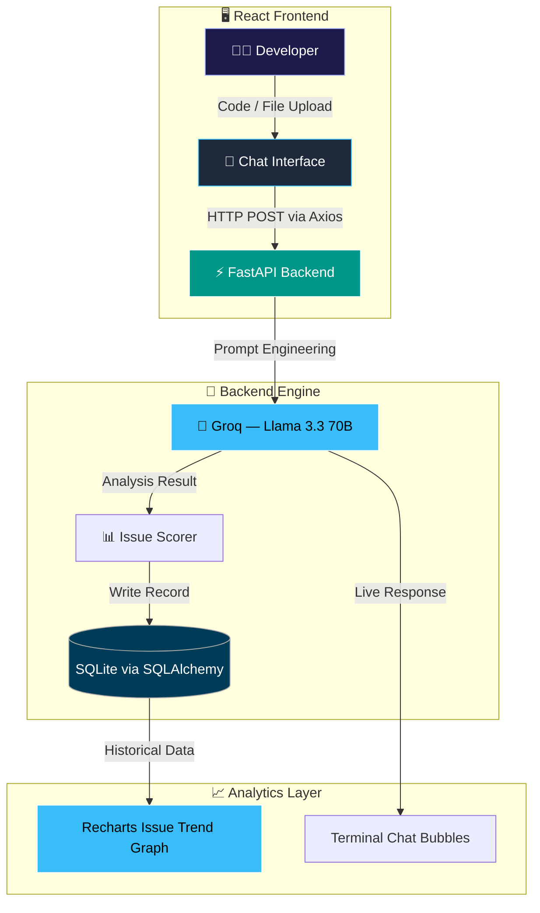

<div align="center">

  <br/>

  [](https://git.io/typing-svg)

  <br/>

  

  <br/><br/>

  [](https://reactjs.org)
  [](https://vitejs.dev)
  [](https://fastapi.tiangolo.com)
  [](https://groq.com)
  [](https://sqlite.org)
  [](https://tailwindcss.com)

  <br/>

</div>

---

## 🚩 The Problem: Code Quality Flies Blind

Most developers write code, push it, and *hope* for the best. Security vulnerabilities, creeping complexity, and silent technical debt only surface during expensive late-stage reviews — or worse, in production.

DevScope AI installs a **real-time intelligence layer** directly into your development workflow:

1. Ask it anything about your code — Big O, maintainability, security gaps
2. Upload any file and get targeted refactoring or debugging analysis
3. Track your technical debt as a *measurable trend* over time — not a gut feeling

**No more flying blind. Your AI co-pilot is always watching.**

---

## ✨ Features

| Feature | Description |
|---|---|
| 🔍 **Intelligent Analysis** | Real-time feedback on Time Complexity (Big O), Maintainability scores, and Security vulnerabilities |
| 📁 **Smart File Uploads** | Attach `.py`, `.js`, or `.cpp` files with specific refactoring or debugging instructions |
| 📈 **Issue Trend Graph** | Data-driven line chart tracking code issues over time via persistent SQLite |
| 🎨 **Cinematic UI** | Glassmorphism Space Theme with a live starfield, terminal-style interface, and smooth animations |
| ⚡ **Lightning-Fast AI** | Groq LPU inference with Llama 3.3 70B for near-instantaneous responses |

---

## 🏗️ Architecture



---

## 🛠️ Tech Stack

| Layer | Technologies |
|---|---|
| **Frontend** | React.js, Vite, Tailwind CSS, Framer Motion, Recharts, Lucide React |
| **Backend** | Python 3.8+, FastAPI, Uvicorn |
| **AI Engine** | Groq SDK — Llama 3.3 70B |
| **Database** | SQLite, SQLAlchemy ORM |
| **File Handling** | python-multipart |
| **HTTP Client** | Axios |

---

## 📂 Project Structure

```
devscope-ai/
├── backend/
│   ├── main.py             # FastAPI entry point & API routes
│   ├── analyzer.py         # AI logic & Groq API integration
│   ├── database.py         # SQLite connection & SQLAlchemy models
│   ├── .env                # API keys (environment variables)
│   └── devscope.db         # Auto-generated SQLite database
├── frontend/
│   ├── src/
│   │   ├── components/
│   │   │   ├── Sidebar.jsx
│   │   │   ├── ChatBubble.jsx
│   │   │   ├── CodeWindow.jsx
│   │   │   ├── MetricsBar.jsx
│   │   │   ├── InputArea.jsx
│   │   │   ├── IssueGraph.jsx
│   │   │   └── Starfield.jsx
│   │   ├── App.jsx         # Main logic & state
│   │   ├── main.jsx        # React entry point
│   │   └── index.css       # Global styles & Tailwind
│   ├── tailwind.config.js
│   ├── package.json
│   └── vite.config.js
└── README.md
```

---

## 🚀 Getting Started

### Prerequisites
- Python 3.8+
- Node.js v16+ & npm
- A [Groq API key](https://console.groq.com) (free)

---

### 1. Backend Setup

```bash
# Navigate to the backend folder
cd backend

# Create and activate a virtual environment
python -m venv .venv

# Windows
.\.venv\Scripts\activate
# Mac / Linux
source .venv/bin/activate

# Install dependencies
pip install fastapi uvicorn sqlalchemy groq python-dotenv python-multipart
```

**Configure environment variables** — create a `.env` file in `backend/`:

```env
GROQ_API_KEY=your_gsk_key_here
```

**Start the backend:**

```bash
python main.py
# Running at http://localhost:8000
```

---

### 2. Frontend Setup

```bash
# Navigate to the frontend folder
cd ../frontend

# Install dependencies
# (includes axios, recharts, lucide-react, react-syntax-highlighter, framer-motion)
npm install --legacy-peer-deps

# Start the dev server
npm run dev
# Running at http://localhost:5173
```

| Service | URL |
|---|---|
| Frontend UI | `http://localhost:5173` |
| Backend API | `http://localhost:8000` |
| API Docs (Swagger) | `http://localhost:8000/docs` |

---

## 📊 Usage Guide

**💬 Chat** — Type any coding question (e.g. *"Write an optimized quicksort in Python"*) and hit Send. The AI responds with code, complexity analysis, and suggestions.

**📁 Analyze a File** — Click the **Paperclip** icon or the **Upload** icon in the sidebar to attach a `.py`, `.js`, or `.cpp` file. Add specific instructions (e.g. *"Check this for SQL injection"*) and hit Send.

**📈 Analytics** — Click the **Bar Chart** icon in the sidebar to view your issue trend graph — a persistent record of code health over time.

**🔄 Dashboard** — Click the **Grid** icon to reset your current session and start a fresh analysis.

---

## 🤝 Contributing

Contributions that improve the following are especially welcome:

- **Prompt Engineering** — more accurate Big O and security scoring prompts
- **New File Type Support** — extending uploads to `.ts`, `.go`, `.rs`, `.java`
- **Database Adapters** — PostgreSQL support via SQLAlchemy
- **UI Themes** — additional Glassmorphism or terminal-dark variants

Please open an issue before submitting a large PR so we can align on direction.

---

## 📄 License

This project is open source. See [LICENSE](LICENSE) for details.

---

<div align="center">
  <p>Built for developers who care about code quality. ⚡</p>
  <p><i>DevScope AI — Real-time intelligence. Zero compromise.</i></p>
</div>
